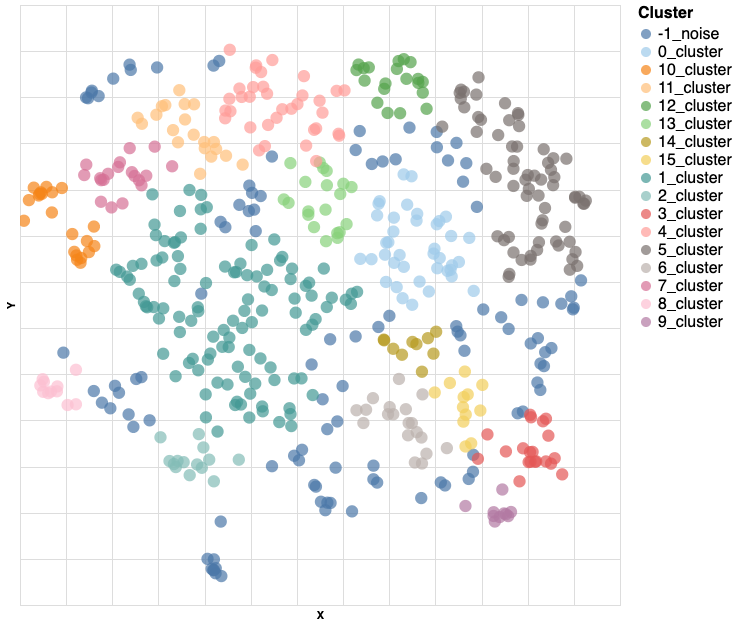

# Assessing Student Feedback from Large Class Surveys via Topic Modeling

Notebook (Sentence Transformers) [![Open In Colab][colab-badge]][notebook]

Notebook (Cohere) [![Open In Colab][colab-badge]][notebook-cohere]

[notebook]: <https://colab.research.google.com/drive/1mTNwulr2rKcdm2j9kCujaGN0tEdp_9ua?usp=sharing>
[notebook-cohere]: <https://colab.research.google.com/drive/1H7nK2TOmENLKqLq9ogOoXzL-4UI9Zsor?usp=sharing>
[colab-badge]: <https://colab.research.google.com/assets/colab-badge.svg>

---

## About

This is a topic modeling tool designed to help professors at the University of Toronto assess student feedback from surveys in large classes they are instructing. The Colab notebooks linked above provide an interface for easy use of the tool that gives an interpretable and interactive visualization of the results.

By providing surveys to students in their class, professors can get feedback on various things. However, for large classes, it is difficult and time-consuming to assess this feedback simply by reading the survey answers, as there are many submissions. Using this topic modeling tool, professors can painlessly assess the feedback from surveys in classes with 1000+ students in a few seconds.

The topics that the algorithm outputs will highlight recurring ideas discovered in the survey answers in an interpretable manner. 

## How It Works

The algorithm can be broken into 5 main steps.

1. **Text preprocessing:** Given a dataset containing survey answers, the algorithm first cleans and preprocesses the text. The text is broken up into sentences.

2. **Embedding:** Using a pre-trained transformer model from [Sentence Transformers](https://www.sbert.net/docs/pretrained_models.html) or [Cohere](https://cohere.ai/), these sentences are embedded into a higher dimensional semantic space and converted into vectors. 

3. **Dimension reduction:** The algorithm then reduces the dimensionality of these sentence embeddings using [UMAP](https://umap-learn.readthedocs.io/en/latest/index.html#). This will allow for more visually interperetable results.

4. **Clustering:** These lower dimensional embeddings are then clustered using the [DBSCAN algorithm](https://scikit-learn.org/stable/modules/clustering.html#dbscan). 

5. **Topic extraction:** Topics are extracted for each cluster by computing the within cluster unigram frequencies, applying the class TF-IDF, then selecting the most frequent words. 

## Example Usage

The excel file [./example/classroom_norms.xlsx](./example/classroom_norms.xlsx) contains a student survey from the course "MAT188: Linear Algebra for Engineers" during Fall 2022. In this example, we apply the topic modeling algorithm to this dataset.

**The survey question:** 
"Our goal is to foster a safe and encouraging environment in which you all feel comfortable working together and sharing your thoughts with each other. To make that happen, what do you need or expect from yourself?"

### Parameters
- **question_n**: 0
- **model:** all-MiniLM-L12-v2
- **embed_dim**: 2 
- **eps**: 0.35 
- **min_samples**: 10

### Results

|class|size|topics                                                       |
|-----|----|-------------------------------------------------------------|
|-1   |109 |need_get_help_stay_organized                                 |
|0    |39  |course_class_linear_professor_algebra                        |
|1    |111 |help_others_questions_open_ask                               |
|2    |14  |mistakes_make_need_afraid_first                              |
|3    |20  |assignments_complete_early_sure_time                         |
|4    |35  |would_thoughts_like_others_peers                             |
|5    |66  |prepared_lectures_material_come_class                        |
|6    |19  |organized_top_stay_work_everything                           |
|7    |19  |inclusive_zone_comfort_others_nonjudgmental                  |
|8    |11  |ask_questions_hours_office_lost                              |
|9    |10  |procrastinate_procrastination_punctual_procrastinating_timely|
|10   |21  |respect_respectful_learn_level_openminded                    |
|11   |20  |group_ideas_participation_peers_active                       |
|12   |20  |class_participate_actively_discussions_friends               |
|13   |20  |learning_skills_ideas_environment_peers                      |
|14   |10  |actually_classes_grades_time_attend                          |
|15   |12  |time_management_assignments_ensure_good                      |

### Visualization

To visualize this plot interactively, download [this .html file](./example/visual.html) and open it in your browser.

## Acknowledgements

This project done in collaboration with Professor Camelia Karimianpour, Professor Vardan Papyan, and Daniel Tovbis.
